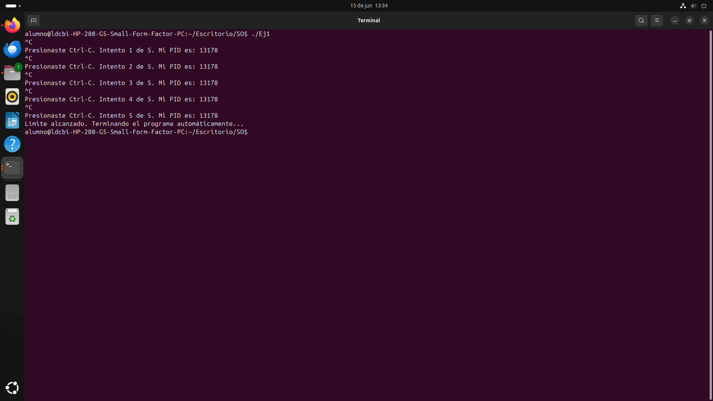
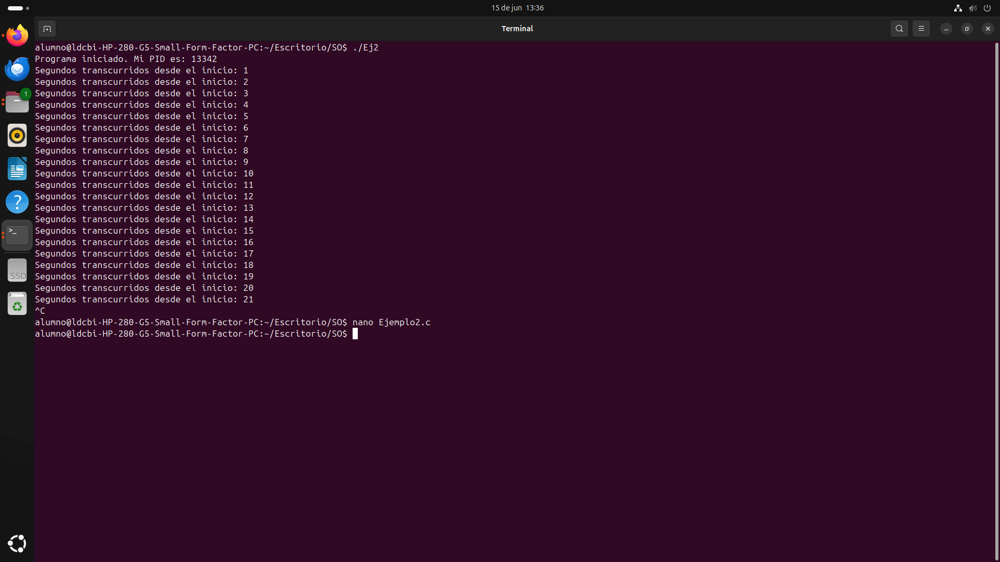
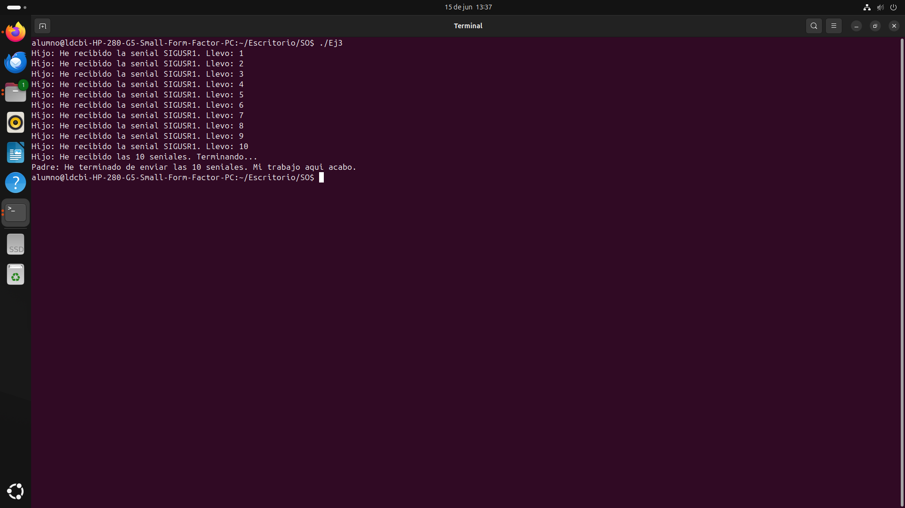
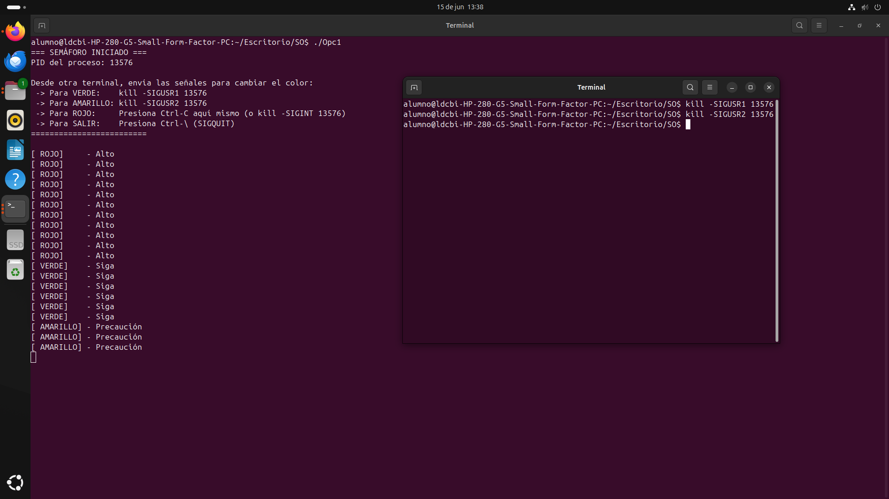

# Práctica: Procesos y Señales

**Alumno:** Omar Samuel Hernández Acosta  
**Institución:** Universidad Autónoma Metropolitana, Unidad Iztapalapa - Licenciatura en Computación  

Este repositorio contiene el código fuente de los ejercicios desarrollados para la práctica de Procesos y Señales en sistemas Unix/Linux.

---

## 💻 Ejercicio 1: Cachando la señal Ctrl-C

Este programa intercepta la señal `SIGINT` (Ctrl-C) para evitar que el proceso termine por defecto, ejecutando un manejador personalizado que muestra el PID del proceso y cuenta los intentos hasta llegar a 5.

* **Cómo compilar:** `gcc Ejercicio_1.c -o Ejercicio_1`
* **Cómo ejecutar:** `./Ejercicio_1`

### Evidencia de ejecución

---

## ⏱️ Ejercicio 2: Activando una alarma

Implementación de un temporizador periódico utilizando `alarm()` y `pause()`. El programa envía la señal `SIGALRM` cada segundo, despertando al proceso para mostrar el tiempo transcurrido sin consumir CPU en espera activa.

* **Cómo compilar:** `gcc Ejercicio_2.c -o Ejercicio_2`
* **Cómo ejecutar:** `./Ejercicio_2`

### Evidencia de ejecución

---

## 📡 Ejercicio 3: Enviando una señal desde un proceso

Demostración de comunicación entre procesos (Padre e Hijo) mediante `fork()`. El proceso padre envía 10 señales `SIGUSR1` utilizando la función `kill()`, mientras que el proceso hijo las contabiliza.

* **Cómo compilar:** `gcc Ejercicio_3.c -o Ejercicio_3`
* **Cómo ejecutar:** `./Ejercicio_3`

### Evidencia de ejecución

---

## 🚦 Ejercicio Integrador: Semáforo controlado por señales

Programa que simula el estado de un semáforo utilizando un único manejador para múltiples señales. 
* `SIGUSR1` cambia el estado a VERDE.
* `SIGUSR2` cambia el estado a AMARILLO.
* `SIGINT` cambia el estado a ROJO.

* **Cómo compilar:** `gcc Ejercicio_Integrador.c -o semaforo`
* **Cómo ejecutar:** `./semaforo`

### Evidencia de ejecución

---

## 🤖 Uso de Inteligencia Artificial (Preguntas y Respuestas)

Durante el desarrollo de esta práctica, se utilizó IA para profundizar en los conceptos teóricos y resolver dudas de implementación. A continuación, se documentan las consultas principales:

**1. ¿Cómo construir un temporizador periódico sin que el CPU se vaya al 100%?**
* **Respuesta de la IA:** Se logra combinando las funciones `alarm()` y `pause()` dentro de un bucle. La función `pause()` es clave porque suspende el proceso y cede el uso del CPU hasta que el sistema operativo envía la señal programada por la alarma, evitando el consumo de recursos por espera activa.

**2. ¿Cómo enviar señales entre procesos sin relación padre-hijo?**
* **Respuesta de la IA:** Utilizando la función genérica `kill(pid, señal)`. Esta función no es exclusiva para procesos relacionados; permite enviar cualquier señal a cualquier proceso del sistema, siempre y cuando se conozca su PID exacto y se tengan los permisos necesarios.

**3. ¿Cómo evitar procesos zombie en C?**
* **Respuesta de la IA:** Cuando un proceso hijo termina, el sistema envía la señal `SIGCHLD` al padre. Para evitar que el hijo se convierta en zombie, el padre debe atrapar esta señal y ejecutar la función `wait()` o `waitpid()`. Esto permite leer el estado de salida del hijo y le indica al sistema operativo que ya puede borrar su registro de la tabla de procesos.

**4. ¿Qué es la señal SIGSTOP y por qué no se puede ignorar?**
* **Respuesta de la IA:** `SIGSTOP` es una señal que suspende inmediatamente la ejecución de un proceso, dejándolo en estado de reposo en la memoria. A diferencia de otras señales, no puede ser atrapada mediante `signal()` ni ignorada, ya que es una medida de seguridad del kernel para garantizar que los administradores del sistema siempre puedan congelar procesos problemáticos.
